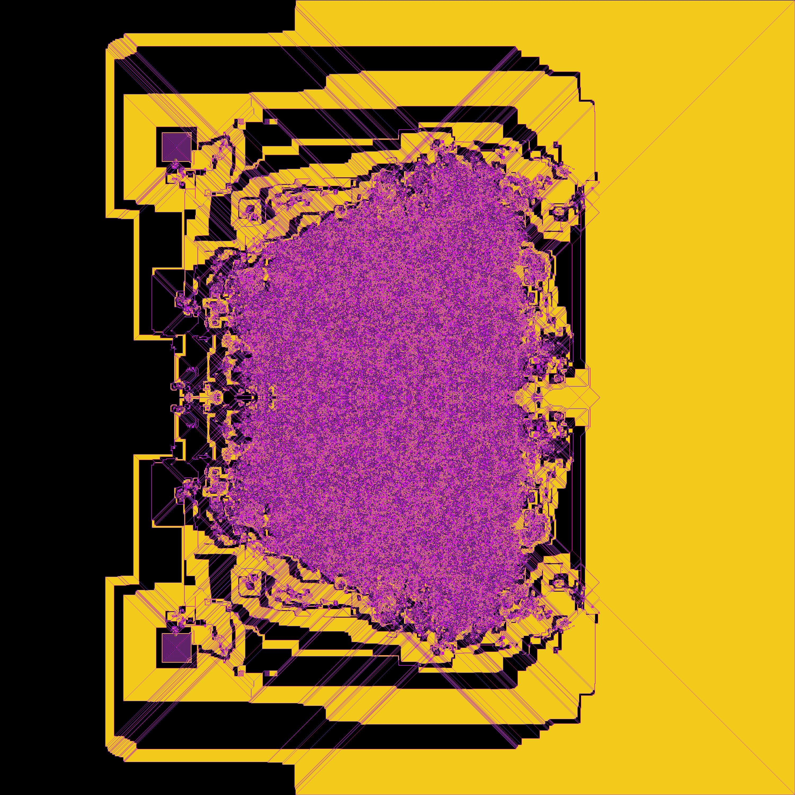

# LangtonsAnt

This is a small project visualizing the path of a Langton ant. You can try out a different set of rules by modifying instructions_list (**R** = turn right and step forward, **L** turn left and step forward). You can also change the colors by modyfing colors_list, just keep in mind that len(colors_list)>=len(instructions_list) must hold.

This interesting symmetrical pattern is generated by the set of instructions ["R", "L", "L", "R"].

A full breakdown of Langton's ant can be found here: https://en.wikipedia.org/wiki/Langton%27s_ant.

Note that this is an old project of mine which I uploaded just now.
